# PeasyPrints Flutter UI-Technology Architecture Diagram

## Diagram Purpose
This diagram visualizes how the PeasyPrints Flutter application's UI layer connects with the underlying technology stack, showing data flow from user interactions to technical services and state management integration.

## Mermaid Architecture Diagram

```mermaid
flowchart TD
    %% User Interface Layer - Main Screens
    subgraph UI_LAYER ["🎨 User Interface Layer"]
        SPLASH[Screen: SplashScreen]
        LOGIN[Screen: LoginScreen]
        REGISTER[Screen: RegistrationScreen]
        OTP[Screen: OTPEntryScreen]
        HOME[Screen: HomeScreen]
        SHOPS[Screen: ShopsScreen]
        ORDERS[Screen: OrdersScreen]
        PROFILE[Screen: ProfileScreen]
        UPLOAD[Screen: UploadScreen]
        DIALOG[Widget: CustomDialog]
    end

    %% User Interaction Layer
    subgraph INTERACTIONS ["👆 User Interactions"]
        AUTH_ACTION[Action: Phone/Email Auth]
        NAV_ACTION[Action: Navigation]
        UPLOAD_ACTION[Action: File Upload]
        PAYMENT_ACTION[Action: Payment]
        SHOP_SELECT[Action: Shop Selection]
        ORDER_TRACK[Action: Order Tracking]
    end

    %% State Management Layer
    subgraph STATE_MGMT ["🔄 State Management"]
        PROVIDER[Provider: GlobalProvider]
        AUTH_STATE[State: Auth Status]
        SHOP_STATE[State: Shop Data]
        ORDER_STATE[State: Order Data]
        FILE_STATE[State: File Processing]
    end

    %% Technology Services Layer
    subgraph TECH_SERVICES ["⚙️ Technology Services"]
        FIREBASE_AUTH[Service: Firebase Auth]
        FIRESTORE[Service: Firestore DB]
        STORAGE[Service: Firebase Storage]
        RAZORPAY[Service: Razorpay Payment]
        LOCATION[Service: Geolocation]
        FILE_PICKER[Service: File Picker]
        PDF_PROCESS[Service: PDF Processing]
    end

    %% External Services Layer
    subgraph EXTERNAL ["🌐 External Services"]
        FIREBASE_CLOUD[External: Firebase Cloud]
        SMS_SERVICE[External: SMS Gateway]
        PAYMENT_GATEWAY[External: Razorpay API]
        GOOGLE_SERVICES[External: Google Services]
    end

    %% UI to Interaction Connections
    SPLASH --> |"2s delay + auth check"| AUTH_ACTION
    LOGIN --> |"phone/email input"| AUTH_ACTION
    REGISTER --> |"user registration"| AUTH_ACTION
    OTP --> |"6-digit verification"| AUTH_ACTION
    
    HOME --> |"shop browsing"| NAV_ACTION
    SHOPS --> |"shop selection"| SHOP_SELECT
    UPLOAD --> |"document upload"| UPLOAD_ACTION
    DIALOG --> |"payment processing"| PAYMENT_ACTION
    ORDERS --> |"order tracking"| ORDER_TRACK

    %% Interaction to State Management
    AUTH_ACTION --> |"auth state change"| AUTH_STATE
    SHOP_SELECT --> |"shop data loading"| SHOP_STATE
    UPLOAD_ACTION --> |"file processing"| FILE_STATE
    ORDER_TRACK --> |"order data update"| ORDER_STATE
    
    AUTH_STATE --> PROVIDER
    SHOP_STATE --> PROVIDER
    FILE_STATE --> PROVIDER
    ORDER_STATE --> PROVIDER

    %% State Management to Technology Services
    AUTH_STATE --> |"authentication"| FIREBASE_AUTH
    SHOP_STATE --> |"real-time data"| FIRESTORE
    FILE_STATE --> |"file upload"| STORAGE
    FILE_STATE --> |"PDF processing"| PDF_PROCESS
    FILE_STATE --> |"file selection"| FILE_PICKER
    
    PAYMENT_ACTION --> |"payment processing"| RAZORPAY
    SHOP_SELECT --> |"location services"| LOCATION

    %% Technology Services to External Services
    FIREBASE_AUTH --> |"phone verification"| SMS_SERVICE
    FIREBASE_AUTH --> |"user management"| FIREBASE_CLOUD
    FIRESTORE --> |"data persistence"| FIREBASE_CLOUD
    STORAGE --> |"file storage"| FIREBASE_CLOUD
    RAZORPAY --> |"payment gateway"| PAYMENT_GATEWAY
    LOCATION --> |"location services"| GOOGLE_SERVICES

    %% Response Flow Back to UI
    FIREBASE_CLOUD --> |"auth response"| AUTH_STATE
    FIREBASE_CLOUD --> |"shop data"| SHOP_STATE
    FIREBASE_CLOUD --> |"order updates"| ORDER_STATE
    PAYMENT_GATEWAY --> |"payment status"| PROVIDER
    
    AUTH_STATE --> |"login success"| HOME
    SHOP_STATE --> |"shop list update"| SHOPS
    ORDER_STATE --> |"order status update"| ORDERS
    FILE_STATE --> |"file processed"| UPLOAD

    %% Real-time Data Flow
    FIRESTORE --> |"stream updates"| SHOP_STATE
    FIRESTORE --> |"stream updates"| ORDER_STATE
    
    %% Error Handling Flow
    FIREBASE_AUTH --> |"auth error"| AUTH_STATE
    RAZORPAY --> |"payment error"| PROVIDER
    PDF_PROCESS --> |"processing error"| FILE_STATE

    %% Styling
    classDef uiLayer fill:#e1f5fe,stroke:#01579b,stroke-width:2px
    classDef interactionLayer fill:#f3e5f5,stroke:#4a148c,stroke-width:2px
    classDef stateLayer fill:#e8f5e8,stroke:#1b5e20,stroke-width:2px
    classDef techLayer fill:#fff3e0,stroke:#e65100,stroke-width:2px
    classDef externalLayer fill:#fce4ec,stroke:#880e4f,stroke-width:2px

    class SPLASH,LOGIN,REGISTER,OTP,HOME,SHOPS,ORDERS,PROFILE,UPLOAD,DIALOG uiLayer
    class AUTH_ACTION,NAV_ACTION,UPLOAD_ACTION,PAYMENT_ACTION,SHOP_SELECT,ORDER_TRACK interactionLayer
    class PROVIDER,AUTH_STATE,SHOP_STATE,ORDER_STATE,FILE_STATE stateLayer
    class FIREBASE_AUTH,FIRESTORE,STORAGE,RAZORPAY,LOCATION,FILE_PICKER,PDF_PROCESS techLayer
    class FIREBASE_CLOUD,SMS_SERVICE,PAYMENT_GATEWAY,GOOGLE_SERVICES externalLayer
```

## Component Legend

### 🎨 User Interface Layer
- **Screens**: Main application screens (SplashScreen, LoginScreen, etc.)
- **Widgets**: Reusable UI components (CustomDialog, ShopCard, etc.)

### 👆 User Interactions
- **Actions**: User-triggered events (authentication, navigation, file upload, etc.)
- **Patterns**: Common interaction patterns across the application

### 🔄 State Management
- **Provider**: Global state management using Provider pattern
- **States**: Specific state categories (Auth, Shop, Order, File)

### ⚙️ Technology Services
- **Services**: Internal service implementations (Firebase Auth, Firestore, etc.)
- **Platform**: Platform-specific services (File Picker, Geolocation, etc.)

### 🌐 External Services
- **External**: Third-party services and APIs (Firebase Cloud, SMS Gateway, etc.)

## Key Relationships

### Authentication Flow
1. **User Input** → LoginScreen/RegistrationScreen
2. **Phone/Email Auth** → Firebase Auth Service
3. **OTP Verification** → SMS Gateway
4. **Auth Response** → Global Provider State
5. **State Update** → Navigation to HomeScreen

### Shop Discovery Flow
1. **Shop Browsing** → HomeScreen/ShopsScreen
2. **Location Services** → Google Services
3. **Shop Data** → Firestore Real-time Stream
4. **State Update** → ShopCard Widget Updates

### Order Processing Flow
1. **File Upload** → UploadScreen
2. **PDF Processing** → Local PDF Processing Service
3. **File Storage** → Firebase Storage
4. **Payment Processing** → Razorpay Payment Gateway
5. **Order Creation** → Firestore Database
6. **Real-time Updates** → OrdersScreen

### Payment Integration Flow
1. **Payment Action** → CustomDialog Widget
2. **Payment Processing** → Razorpay Service
3. **Gateway Communication** → Razorpay API
4. **Payment Response** → Provider State Update
5. **Order Confirmation** → OrdersScreen

## Technology Stack Summary

### Frontend Technologies
- **Flutter Framework**: UI rendering and platform abstraction
- **Provider Pattern**: State management
- **Material Design**: UI component library
- **Google Fonts**: Typography system

### Backend Services
- **Firebase Auth**: Authentication (Phone/Email)
- **Firestore**: Real-time database
- **Firebase Storage**: File storage
- **Firebase App Check**: App verification

### External Integrations
- **Razorpay**: Payment gateway
- **SMS Gateway**: OTP delivery
- **Google Services**: Location and Play Services
- **File Processing**: PDF manipulation libraries

### Platform Services
- **File Picker**: Document selection
- **Geolocation**: Location services
- **Path Provider**: File system access
- **URL Launcher**: External link handling

## Architecture Patterns

### State Management Pattern
- **Provider Pattern**: Global state management
- **Local State**: setState() for component-level state
- **Real-time Updates**: StreamBuilder for live data

### Data Flow Pattern
- **Unidirectional Flow**: User Action → State Change → UI Update
- **Real-time Synchronization**: Firebase streams for live updates
- **Error Handling**: Comprehensive error states and fallbacks

### Service Integration Pattern
- **Service Layer**: Abstracted external service calls
- **Platform Abstraction**: Flutter platform channels
- **Error Recovery**: Retry mechanisms and fallback options

This architecture diagram provides a comprehensive view of how the PeasyPrints Flutter application's UI layer integrates with its technology stack, enabling effective migration planning and technical understanding.
