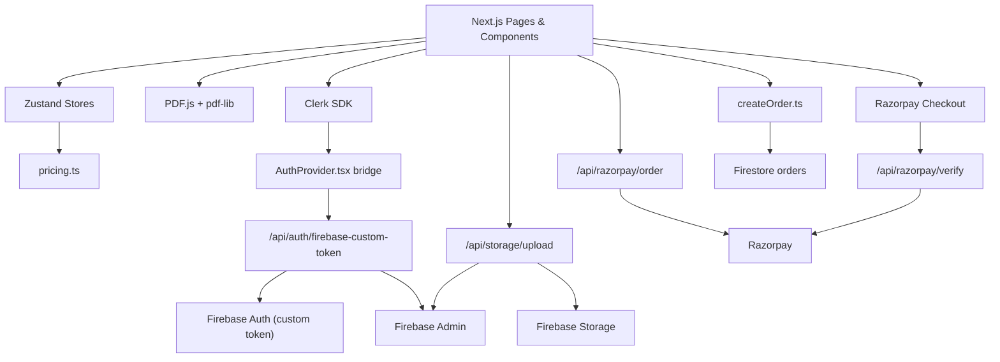
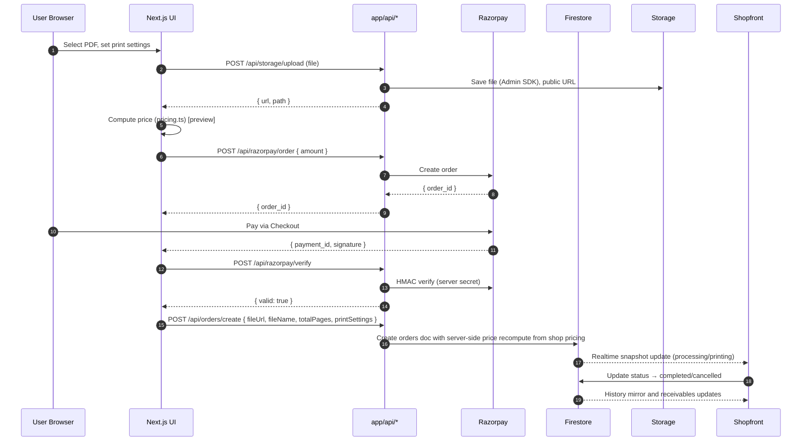

### Purpose
Executive, engineering, and SRE overview of the PeasyPrints web platform: capabilities, user journeys, and system topology.

### At a glance
- Frontend: Next.js 13+ App Router, TS, Tailwind, shadcn/ui, PDF.js, pdf-lib
- State: Zustand stores
- Auth: Clerk UI/session bridged to Firebase (custom token)
- Backend: Firestore, Firebase Storage (Admin SDK for server writes), Razorpay
- PWA: Service worker and precache
- Key flows: Upload → Pricing (preview) → Payment → Verify → Order (server recompute) → Shopfront queue

### Executive summary
PeasyPrints enables users to upload PDFs, configure print settings, pay via Razorpay, and place orders to local print shops. Shops manage queues, update statuses, and track receivables in a Shopfront interface with real-time Firestore updates.

### High-level capabilities
- User auth via Clerk; Firebase custom token allows Firestore/Storage usage.
- PDF upload via server endpoint (Admin SDK) with client SDK fallback.
- Pricing engine with shop overrides and emergency surcharges.
- Payments via Razorpay (server order creation, server signature verification).
- Order lifecycle: pending → processing/printing → completed/cancelled; mirrored to `history`.
- Shopfront: live order queue, pricing management, payouts tracking.

### Key user journeys
- Consumer: Login → Upload → Configure → Pay → Place order → Track status → Pickup.
- Shop: Login → View queue → Update status → Complete/cancel → Track receivables → Withdrawals.

### System context
```mermaid
graph LR
  subgraph User Devices
    U["End User Browser"]
    S["Shopfront Browser"]
  end

  subgraph Frontend (Next.js)
    FE["App Router UI<br/>Zustand Stores"]
    MW["Clerk Middleware"]
  end

  subgraph Backend
    AR["app/api/* Route Handlers"]
    FBA["Firebase Admin SDK"]
    RP["Razorpay API"]
  end

  subgraph Firebase
    FA["Firebase Auth"]
    FS["Firestore"]
    ST["Storage"]
  end

  U <--> FE
  S <--> FE
  FE --> MW
  FE --> AR
  AR --> FBA
  AR --> RP
  FE --> FA
  FE --> FS
  FE --> ST
  FBA --> FS
  FBA --> ST
```

### Component diagram


### Data flow: Upload → Pricing → Razorpay → Verify → Order → Shopfront queue


### Notes
- Orders are created server-side at `/api/orders/create` after payment verification; the server recomputes totals from the shop’s pricing and persists `printSettings` and `pricingDetails`.
- Taxes/rounding policy: inclusive of tax, currency INR; rounding to nearest paise.

### TODO
- Confirm tax policy, discounts, coupons.
- Introduce server-created orders post-verify to harden integrity.
- Add Razorpay webhooks for reconciliation and idempotency ledger.


