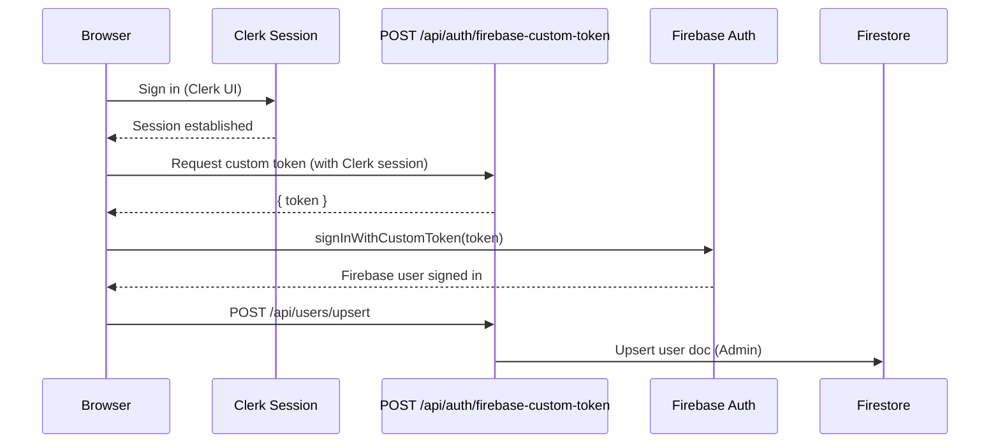

### Purpose
Define runtime, routing, auth, error handling, and caching.

### At a glance
- App Router with `(auth)` group; `middleware.ts` enforces Clerk guards.
- Auth bridge: Clerk → Firebase custom token (server-minted) → Firestore/Storage.
- Node runtime for Storage uploads and cryptography (Razorpay verify).
- Error and retry patterns; idempotency guidance.
- Caching via dynamic route handlers and headers.

### App Router structure and conventions
- All routes under `app/`. Auth flows under `(auth)` group.
- API handlers under `app/api/*`.

```ts
// middleware.ts (excerpt)
import { clerkMiddleware, createRouteMatcher } from '@clerk/nextjs/server';
import { NextResponse } from 'next/server';

const isPublicRoute = createRouteMatcher([
  '/',
  '/upload(.*)',
  '/orders(.*)',
  '/shops(.*)',
  '/shopfront(.*)',
  '/api/(.*)',
  '/login',
  '/otp'
]);

export default clerkMiddleware(async (auth, req) => {
  const { pathname, searchParams } = req.nextUrl;
  const { userId } = await auth();

  const isStatic =
    pathname.startsWith('/_next') ||
    pathname.startsWith('/images') ||
    pathname.startsWith('/fonts') ||
    pathname === '/sw.js' ||
    pathname === '/manifest.json' ||
    pathname === '/favicon.ico' ||
    /\.(png|jpg|jpeg|gif|svg|webp|avif|ico)$/.test(pathname);

  if (isStatic) return NextResponse.next();

  if (pathname.startsWith('/login') && userId) {
    const target = searchParams.get('redirect_url') || '/';
    req.nextUrl.pathname = target || '/';
    req.nextUrl.search = '';
    return NextResponse.redirect(req.nextUrl);
  }

  if (!isPublicRoute(req)) {
    if (!userId) {
      const signInUrl = new URL('/login', req.url);
      signInUrl.searchParams.set('redirect_url', req.nextUrl.pathname + req.nextUrl.search);
      return NextResponse.redirect(signInUrl);
    }
  }
});

export const config = {
  matcher: [
    '/((?!.+\.[\w]+$|_next|images|fonts|sw\\.js|manifest\\.json|favicon\\.ico).*)',
    '/(api|trpc)(.*)'
  ]
};
```

### Auth provider stack (Clerk → Firebase handshake)


```tsx
// src/components/providers/AuthProvider.tsx (bridge excerpt)
useEffect(() => {
  if (!isClerkLoaded || bridgeAttempted) return;
  const current = useAuthStore.getState().user;
  if (clerkUser && !current) {
    setBridgeAttempted(true);
    (async () => {
      try {
        const res = await fetch('/api/auth/firebase-custom-token', { method: 'POST' });
        const data = await res.json().catch(() => ({}));
        const token = data?.token;
        if (token) await signInWithCustomToken(auth, token);
        await fetch('/api/users/upsert', { method: 'POST' });
      } catch {}
    })();
  }
}, [isClerkLoaded, clerkUser, bridgeAttempted]);
```

### Runtime model for `app/api/*`
- Use Edge by default; force Node runtime when:
  - Using `firebase-admin` (Storage/Firestore Admin).
  - Cryptography (Razorpay HMAC).
  - Multipart parsing for uploads.

```ts
// app/api/storage/upload/route.ts
export const runtime = 'nodejs'; // Required for firebase-admin + Buffer
```

```ts
// app/api/razorpay/verify/route.ts
export const dynamic = 'force-dynamic'; // Disable static optimization
```

### Error handling & retries
- Client:
  - Upload: if server upload fails, fallback to client SDK (Storage resumable).
  - Payment: on order creation error, surface error (do not mock order).
  - Verify: if signature fails → hard stop.
- Server:
  - Use typed error responses { error: string }.
  - Log errors with correlation ID.
- Idempotency:
  - Use unique `receipt` for Razorpay order tied to user+timestamp.
  - On verify, record processed `razorpay_payment_id` in Firestore ledger to prevent replay.

### Caching strategy
- API routes are dynamic, no caching.
- Pages:
  - Shop and orders pages rely on client-side real-time Firestore; static shell OK.
- Headers:
  - Add `Cache-Control: no-store` for payment-related endpoints.

### Assumptions
- No server-rendered Firestore data; client subscribes.

### TODO
- Introduce payment ledger doc to ensure idempotency across retries.
- Add per-request correlation IDs across client and server logs.


