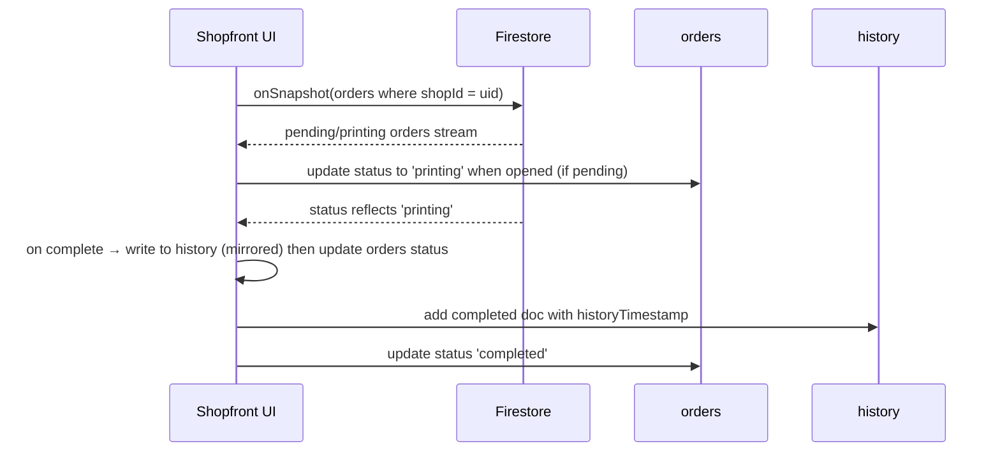

### Purpose
Shopfront lifecycle, real-time subscriptions, and reconciliation.

### At a glance
- Firebase Auth gating; Shop’s UID == `shops/{id}`.
- Real-time listeners for queues and history mirroring.

### Session lifecycle
- On mount, check Firebase Auth; redirect to `/shopfront/login` if unauthenticated.
- After login, subscribe to:
  - `orders` where `shopId == uid`
  - `orders` filter `status in [processing, printing]`
  - `history` where `shopId == uid`

### Real-time updates sequence

### Pricing management
- Shop updates `pricing` nested map on `shops/{uid}`.
- Persist via `updateDoc` with server timestamps.

### Order display (print configuration)
- Queue and history cards surface persisted `printSettings` and totals for the operator:
  - Badges: `paperSize`, `printFormat`, `printColor`
  - Meta: `{copies} copies • {totalPages} pages`
  - Price badge: `₹{totalCost}`
  - Source fields match `OrderDoc.printSettings` and `OrderDoc.pricingDetails`.

### Permissions
- Shop admins: full access to own shop doc and orders.
- Staff (Assumption): read-only queue; status updates only (TODO: add staff role and claims).

### TODO
- Implement staff roles via custom claims or a `shop_members` subcollection.

